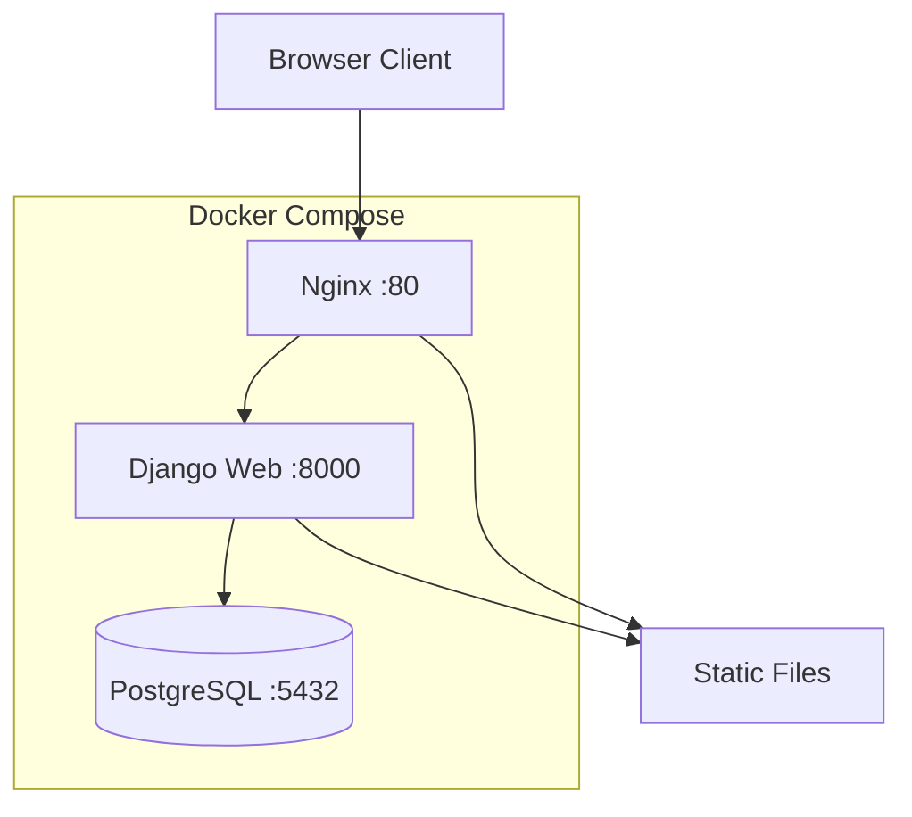
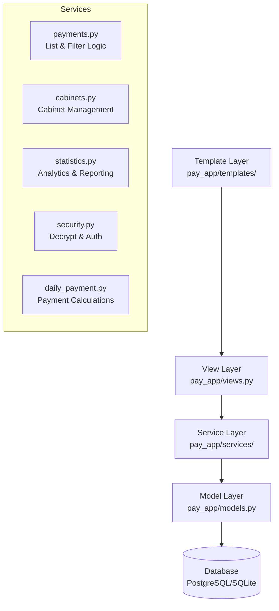
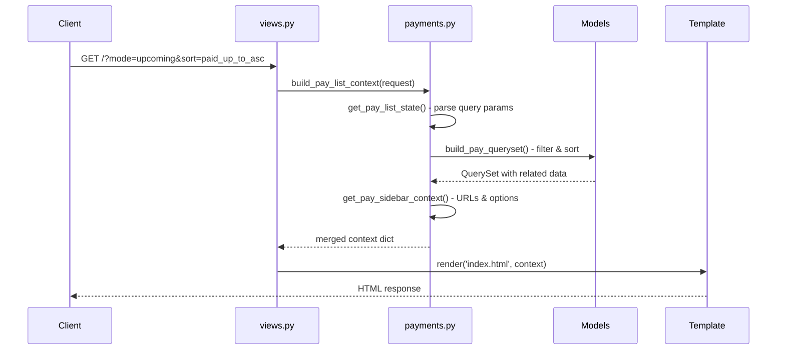
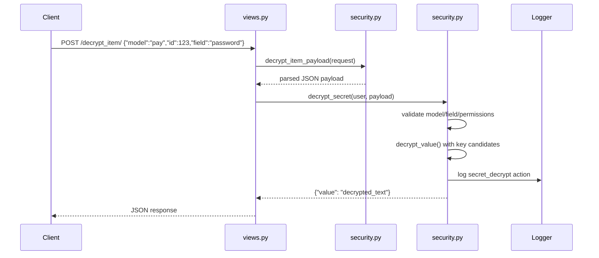
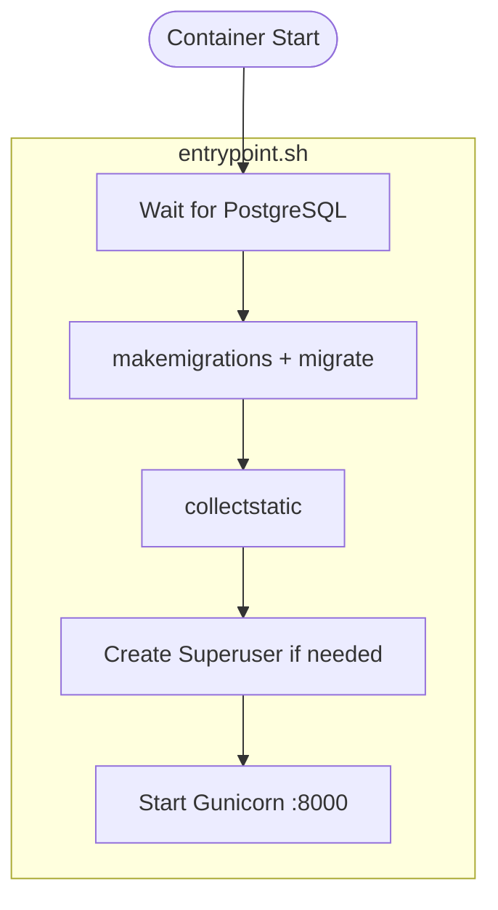

# Architecture and Data Flow

## System Overview

## Layered Structure

1. **View layer** (`pay_app/views.py`)
   - Validates request method/auth decorators
   - Builds forms and delegates business logic to services
   - Returns HTML or JSON responses

2. **Service layer** (`pay_app/services/`)
   - Encapsulates business rules, filtering, and derived calculations
   - Keeps views thin and reusable

3. **Model layer** (`pay_app/models.py`)
   - Defines schema and persistence behavior
   - Applies encryption in `save()` for secret fields

4. **Template layer** (`pay_app/templates/`)
   - Renders server-side HTML pages

## Request Flow Example: Pay List

## Request Flow Example: Decrypt Secret

## Data Integrity and Delete Behavior

- Cabinet delete route is `delete_cabinet/<id>`
- Because `Pay.cabinet` uses `DO_NOTHING`, linked service history is protected from accidental cascade deletion
- Deletion can fail when references still exist; this is expected

## Container Runtime Flow

`entrypoint.sh` boot sequence in `web` container:
1. Wait for PostgreSQL health
2. `makemigrations pay_app`
3. `migrate`
4. `collectstatic`
5. Ensure superuser exists from env vars
6. Start Gunicorn

## Best-Practice Boundaries

- Keep filters and derived query state in `services/payments.py` and `services/cabinets.py`
- Keep analytics math in `services/statistics.py`
- Keep security and decryption checks in `services/security.py`
- Avoid coupling templates to DB logic directly

## Extension Strategy

When adding new feature behavior:
1. Add route to `pay_app/urls.py`
2. Keep view small and delegate to a service function
3. Add service-level unit tests in corresponding `pay_app/tests/tests_*.py`
4. Add docs update under `documentation/`

